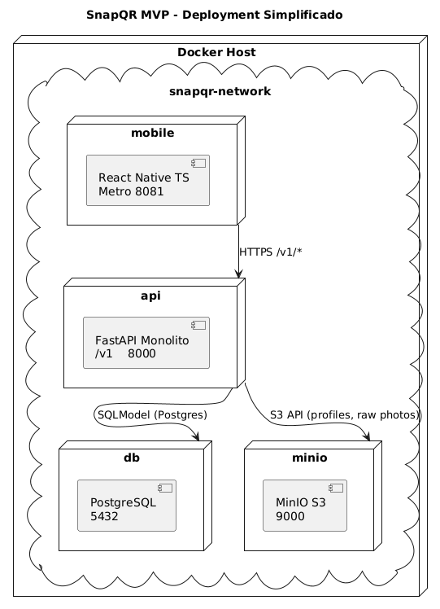
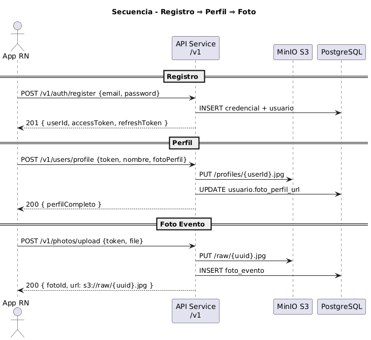
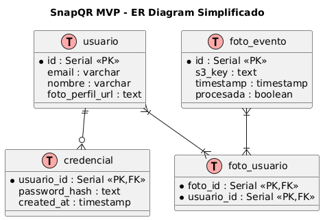

# SnapQR 

SnapQR es un MVP que permite a los asistentes de un evento:

- **Registrarse** y enrolarse con foto de perfil.  
- **Generar y escanear** códigos QR para compartir datos de contacto.  
- **Subir fotos** tomadas durante el evento, almacenarlas en S3 y asociarlas a los usuarios detectados por reconocimiento facial.

Toda la aplicación está empaquetada en contenedores Docker: un backend monolítico en FastAPI, una app móvil en React Native+TypeScript, una base de datos PostgreSQL y MinIO (emulación de S3) para desarrollo.

Nota:
- El codigo en ingles

## Estructura de Carpetas

```bash
snapqr/
├── .env                       # Variables de entorno globales
├── docker-compose.yml         # Orquestación de contenedores
├── README.md                  # Esta documentación
├── backend/                   # Código del API (FastAPI monolito)
│   ├── alembic/               # Migraciones de base de datos
│   ├── app/
│   │   ├── main.py            # Punto de arranque y routers
│   │   ├── config.py          # Pydantic Settings (carga de .env)
│   │   ├── db.py              # Engine y sesión de SQLModel
│   │   ├── models.py          # Definición de tablas con SQLModel
│   │   ├── core/
│   │   │   ├── security.py    # JWT y hashing de contraseñas
│   │   │   └── storage.py     # Cliente S3/MinIO
│   │   ├── routers/
│   │   │   ├── auth.py        # Endpoints /v1/auth
│   │   │   ├── users.py       # Endpoints /v1/users
│   │   │   ├── qr.py          # Endpoints /v1/qr
│   │   │   └── photos.py      # Endpoints /v1/photos
│   │   └── schemas/           # Pydantic models de request/response
│   ├── requirements.txt       # Dependencias Python
│   └── Dockerfile             # Imagen del API
└── mobile/                    # App React Native + TypeScript
    ├── Dockerfile             # Contenedor Metro Bundler
    ├── package.json           # Dependencias JS/TS
    ├── tsconfig.json          # Configuración TypeScript
    ├── babel.config.js        # Babel para RN
    └── src/
        ├── presentation/      # UI: pantallas y componentes
        ├── domain/            # Entidades, casos de uso, interfaces
        ├── data/              # Repositorios, mapeadores, modelos
        └── infrastructure/    # Adaptadores: API client, S3 client
```

## 📝 Explicación del Código y Carpetas

```
backend/app/
	main.py: instancia FastAPI, registra routers y excepciones globales, crea tablas al iniciar.
	config.py: clase Settings que carga variables de entorno (.env).
	db.py: crea engine de SQLModel y genera sesiones.
	models.py: define las tablas con SQLModel y relaciones (1-a-muchos, muchos-a-muchos).
	core/security.py: funciones para crear/validar JWT y hashear contraseñas con bcrypt.
	core/storage.py: cliente de S3/MinIO para operaciones put_object, get_presigned_url.
	routers/: cada archivo (auth.py, users.py, qr.py, photos.py) expone endpoints de su dominio.
	schemas/: Pydantic/SQLModel models para validar requests y formatear responses.

mobile/src/
	presentation/: pantallas (LoginScreen.tsx, ProfileScreen.tsx, PhotoUploadScreen.tsx) y componentes UI.
	domain/: entidades (User.ts), casos de uso (RegisterUser.ts, UploadPhoto.ts) e interfaces (IAuthService.ts).
	data/: implementación de repositorios que usan la API (AuthRepository.ts, PhotoRepository.ts) y mapeo de DTOs.
	infrastructure/api/: axiosClient.ts con baseURL apuntando a http://api:8000/v1, y módulos (authApi.ts, userApi.ts, photoApi.ts).
	infrastructure/storage/: s3Client.ts que convierte URL de S3 a pre-signed URLs para la app.
```

## Requisitos Previos
- [Docker](https://docs.docker.com/get-docker/) >= 20.10
- [docker-compose](https://docs.docker.com/compose/) >= 1.29
- (Opcional) Conocimiento básico de Python y FastAPI.

---

## Cómo Usar

1. **Clonar el repositorio**  
   ```bash
   git clone https://github.com/tuusuario/snapqr.git
   cd snapqr
   ```

2. Copia el .env.example a .env y completa tus credenciales (Postgres, AWS/MinIO, JWT).

3. **Construir los contenedores**
   ```bash
   docker-compose build
   ```

4. **Levantar los servicios**
  ```bash
   docker-compose up -d
  ```

5. **Verificar que todo corre correctamente**
  ```bash
  docker-compose ps
  docker-compose logs -f
  ```

6. Acceder a los servicios
  ```bash
  curl http://localhost:8000/v1/health
  curl http://localhost:8081       # Metro Bundler
  ```


## High Level Architecture

1. **Deployment Diagram**

- api: agrupa Auth, User/Profile, QR y Photo en un solo servicio FastAPI.
- mobile: Metro bundler para RN, recibe cambios en caliente.
- db: PostgreSQL con SQLModel.
- minio: emulación de S3 para desarrollo, expone bucket snapqr-event-photos.




2. **Sequence Diagram – Registro ⇒ Perfil ⇒ Foto**

- El usuario se registra, recibe JWT.
- Envía su perfil con foto, la API guarda la imagen en S3 y actualiza su URL en la base de datos.
- Sube fotos de evento; la API las almacena en S3 y registra un foto_evento.




3. **ER Diagram – Tablas Mínimas**

- usuario: datos básicos y URL de foto de perfil.
- credencial: hash de contraseña y fecha de creación.
- foto_evento: referencia a fotos subidas, si fueron procesadas.
- foto_usuario: tabla intermedia que asocia fotos a usuarios detectados.


