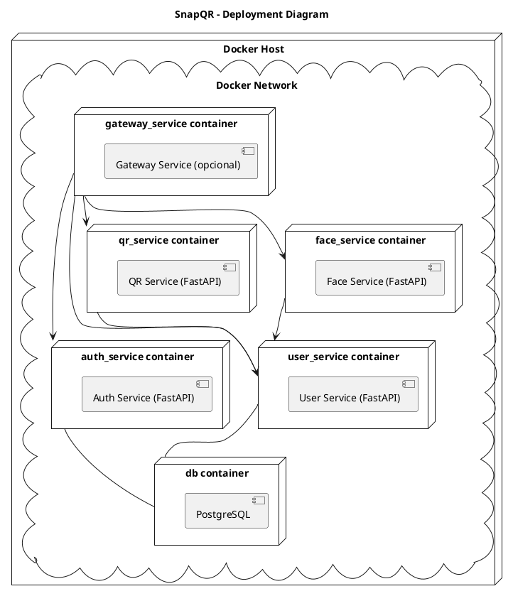

# SnapQR Microservices

**SnapQR** es un sistema basado en microservicios para enrolar usuarios, reconocer rostros y generar/leer códigos QR (inspirado en la necesidad de un evento donde se tomen fotografías y se distribuyan a los participantes identificados por su rostro).

## Tabla de Contenidos
1. [Arquitectura](#arquitectura)
2. [Servicios](#servicios)
3. [Requisitos Previos](#requisitos-previos)
4. [Cómo Usar](#cómo-usar)
5. [Estructura de Carpetas](#estructura-de-carpetas)
6. [Buenas Prácticas y SOLID](#buenas-prácticas-y-solid)
7. [Licencia](#licencia)

---

## Arquitectura
El proyecto sigue un enfoque de **microservicios** con contenedores Docker y un `docker-compose.yml` que orquesta:
- Un servicio de **Base de Datos** (Postgres).
- Servicios independientes para **auth**, **usuarios**, **QR**, **reconocimiento facial** y opcionalmente un **gateway**.
  
Cada microservicio está escrito en **Python** usando **FastAPI** (u otro framework que prefieras).

---

## Servicios

1. **Auth Service**  
   - *Responsabilidad:* Registro de usuarios, login, tokens JWT, etc.

2. **User Service**  
   - *Responsabilidad:* Manejo del perfil de usuario, datos básicos y foto.

3. **QR Service**  
   - *Responsabilidad:* Generar códigos QR con la información de contacto, leer/decodificar QRs.

4. **Face Service**  
   - *Responsabilidad:* Procesar y reconocer rostros en las fotos usando librerías de computer vision.

5. **Gateway Service** (Opcional)  
   - *Responsabilidad:* Punto de entrada unificado para clientes externos, orquestando las rutas a otros microservicios.

6. **DB**  
   - *Responsabilidad:* Almacenar la información. Aquí se puede usar Postgres, MySQL, etc.

---

## Estructura de Carpetas

***
snapqr/
├── services/
│   ├── authentication/
│   │   ├── app/
│   │   │   ├── domain/          # Entidades, modelos del dominio, repos
│   │   │   ├── application/     # Casos de uso, lógica de negocio
│   │   │   ├── infrastructure/  # DB, seguridad, adaptadores
│   │   │   └── main.py          # Punto de arranque (FastAPI)
│   │   ├── requirements.txt
│   │   └── Dockerfile
│   ├── user_managment/
│   ├── qr_generator/
│   ├── face_recognition/
│   └── gateway_service/
├── config/              # Configuraciones globales (env vars, etc.)
├── docker-compose.yml
└── README.md
***


## Requisitos Previos
- [Docker](https://docs.docker.com/get-docker/) >= 20.10
- [docker-compose](https://docs.docker.com/compose/) >= 1.29
- (Opcional) Conocimiento básico de Python y FastAPI.

---

## Cómo Usar

1. **Clonar el repositorio**  
   ```bash
   git clone https://github.com/tuusuario/snapqr.git
   cd snapqr
   ```

2. **Construir los contenedores**
   ```bash
   docker-compose build
   ```

3. **Levantar los servicios**
  ```bash
   docker-compose up -d
  ```

4. **Verificar que todo corre correctamente**
  ```bash
  docker-compose ps
  docker-compose logs -f
  ```

5. Acceder a los servicios
  ```bash
   Gateway Service (si está configurado): http://localhost:8000
   Authenticator: http://localhost:8001
   User Managment: http://localhost:8002
   QR Generator: http://localhost:8003
   Face Recognition: http://localhost:8004
   ```


## 1. **Deployment Diagram** (Arquitectura de microservicios en contenedores)

Representa cómo están distribuidos los microservicios en contenedores y su interacción con la base de datos.


